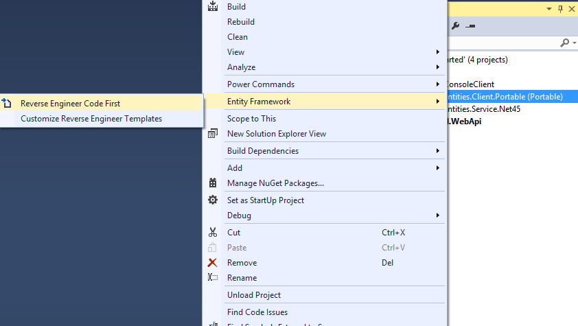
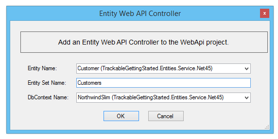
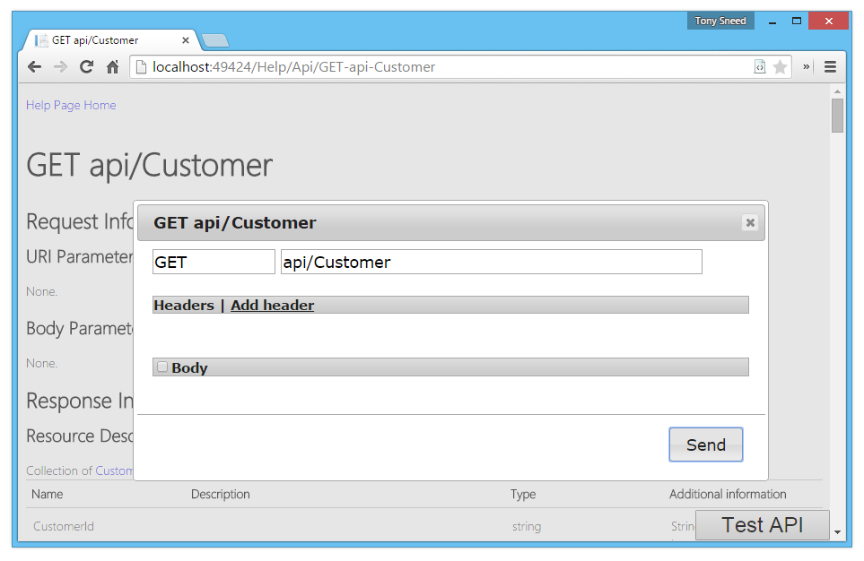

This tutorial provides step-by-step instructions for building an N-Tier **ASP.NET Web API** application from scratch using **Trackable Entities**.

## Solution Creation

### 1. Create a new Trackable Web API Application

  - Create a **New Project**, select the **Trackable** category, then choose **Trackable Web API Application**.


  **Solution Structure**: The wizard will create a new Visual Studio solution with the following projects:
  
  - ConsoleClient
  - Entities.Client.Portable
  - Entities.Service.Net45
  - WebApi


### 2. Choose the **kinds of entities** you would like to generate

  - **Client / Service Entities**: Generate **separate entities** for client and for service. Choose this option if you prefer entities which reflect a *greater separation of concerns*, for example, where client entities contain data binding and change tracking code but service entities do not.

  - **Shared Entities**: Generate **shared entities** in a .NET 4.5 class library that is *shared between client and for service*. Choose this option if you prefer *shared code* and less *code duplication*, for example, change tracking can be performed on both the client and service.


  **.NET 4.5 Entities**: Generate entities for a **.NET 4.5 Class Library** so that they can be used by client applications based on .NET 4.5 or greater.
  
  **Portable Entities**: Generate entities for a **Portable Class Library** so that they can be used by a variety of client applications, such as WPF, Windows Store, Windows Phone, iOS and Android.  *Note this option is available only for separate client / service entities*.


### 3. Update NuGet packages to the latest version

  - **Update Solution NuGet Packages**: Right-click *solution* and select **Manage NuGet packages for solution**.
  - Search for **trackable**, then update the *Trackable Client, Common, and EF6* packages to the latest version.


## Entity Generation

Trackable entities are generated with EF designer tools using *customizable* **T4 templates** included with class library projects created by the Visual Studio wizard. T4 templates may be replaced using one of the available **TrackableEntities.CodeTemplates** NuGet packages.

### 4. Generate Entities with EF 6.x Tools for Visual Studio

  - Add an **ADO.NET Entity Data Model** to the **Entities.Service.Net45** project. This option is also appropriate for *shared entities*.


  - **Choose model contents**: Select either *EF Designer from database* or *Code First from database*. Code first is recommended, as EDMX models will be deprecated in a future version of Entity Framework.


  - **Select or create a data connection**: If necessary create a new data connection to the NorthwindSlim database for SQL Express.  Make sure to *install the prerequisites* listed on the Trackable Entities [installation](1-installation.html) page.


  - **Choose a data connection**: Confirm choice of a data connection and the connection string name in App.Config.


  - **Select tables**: Select which tables you wish to use for generating entities.


### 5. Generate Entities with EF Power Tools

  - Select the **Entities.Client.Portable** project. If necessary, install the *Entity Framework Power Tools* according to instructions on the [installation](1-installation.html) page.
  - It's also possible to create client entities using the EF 6.x Tools for Visual Studio, but if a **Portable Class Library** is desired, you would first create a .NET 4.5 Class Library and then link to entity classes from the Entities.Client.Portable project.
  - Right-click the **Entities.Client.Portable** project, select **Entity Framework**, then **Reverse Engineer Code First**.



  **Important**: After the EF Power Tools wizard has finished generating entities, *delete* both the **NorthwindSlimContext.cs** file and the **Mapping** folder.

  - *Build the solution.*

## Web API Controllers

In this part you'll add *controllers* to the Web API project which perform CRUD operation (Create, Retrieve, Update and Delete) using trackable entities generated for the **Entities.Service.Net45** project.

### 6. Copy Database Connection String to Web.Config

- Copy the database connection string from the **App.config** file of the **Entities.Service.Net45** project to the *connectionStrings* section of the **Web.config** file of the **WebApi** project.

```xml
<connectionStrings>
  <add name="NorthwindSlim" connectionString="data source=.\sqlexpress;initial catalog=NorthwindSlim;integrated security=True;MultipleActiveResultSets=True;App=EntityFramework" providerName="System.Data.SqlClient" />
</connectionStrings>
```

### 7. Add controllers to the WebApi project

- Right-click the **Controllers** folder of the **WebApi** project and select **Add New Item**.
- Expand the **Trackable** category, then select the **Web** sub-category, then choose **Entity Web API Controller**, and enter the name of an *entity class* with the *Controller* suffix.


- Select an **entity name** from the dropdown list, type an **entity set name**, and select a **DbContext name** from the dropdown list.



If necessary, change the type for the primary key property, for example from ```int``` to ```string```.

- The generated controller class should resemble something like the following:

```csharp
public class CustomerController : ApiController
{
    private readonly NorthwindSlim _dbContext = new NorthwindSlim();

    // GET api/Customer
    [ResponseType(typeof(IEnumerable<Customer>))]
    public async Task<IHttpActionResult> GetCustomers()
    {
        IEnumerable<Customer> entities = await _dbContext.Customers
            .ToListAsync();

        return Ok(entities);
    }

    // GET api/Customer/5
    [ResponseType(typeof(Customer))]
    public async Task<IHttpActionResult> GetCustomer(string id)
    {
        Customer entity = await _dbContext.Customers
            .SingleOrDefaultAsync(e => e.CustomerId == id);

        if (entity == null)
        {
            return NotFound();
        }

        return Ok(entity);
    }

    // POST api/Customer
    [ResponseType(typeof(Customer))]
    public async Task<IHttpActionResult> PostCustomer(Customer entity)
    {
        if (!ModelState.IsValid)
        {
            return BadRequest(ModelState);
        }

        entity.TrackingState = TrackingState.Added;
        _dbContext.ApplyChanges(entity);


        try
        {
            await _dbContext.SaveChangesAsync();
        }
        catch (DbUpdateException)
        {
            if (_dbContext.Customers.Any(e => e.CustomerId == entity.CustomerId))
            {
                return Conflict();
            }
            throw;
        }

        await _dbContext.LoadRelatedEntitiesAsync(entity);
        entity.AcceptChanges();
        return CreatedAtRoute("DefaultApi", new { id = entity.CustomerId }, entity);
    }

    // PUT api/Customer
    [ResponseType(typeof(Customer))]
    public async Task<IHttpActionResult> PutCustomer(Customer entity)
    {
        if (!ModelState.IsValid)
        {
            return BadRequest(ModelState);
        }

        _dbContext.ApplyChanges(entity);

        try
        {
            await _dbContext.SaveChangesAsync();
        }
        catch (DbUpdateConcurrencyException)
        {
            if (!_dbContext.Customers.Any(e => e.CustomerId == entity.CustomerId))
            {
                return Conflict();
            }
            throw;
        }

        await _dbContext.LoadRelatedEntitiesAsync(entity);
        entity.AcceptChanges();
        return Ok(entity);
    }

    // DELETE api/Customer/5
    public async Task<IHttpActionResult> DeleteCustomer(string id)
    {
        Customer entity = await _dbContext.Customers
            .SingleOrDefaultAsync(e => e.CustomerId == id);
        if (entity == null)
        {
            return Ok();
        }

        entity.TrackingState = TrackingState.Deleted;
        _dbContext.ApplyChanges(entity);

        try
        {
            await _dbContext.SaveChangesAsync();
        }
        catch (DbUpdateConcurrencyException)
        {
            if (!_dbContext.Customers.Any(e => e.CustomerId == entity.CustomerId))
            {
                return Conflict();
            }
            throw;
        }

        return Ok();
    }

    protected override void Dispose(bool disposing)
    {
        _dbContext.Dispose();
        base.Dispose(disposing);
    }
}
```

- Now add an **Order** controller to the **WebApi** project.
- Add a ```GetOrders``` method that accepts a ```customerId``` parameter of type ```string``` and filters orders by the specified customer id.
- Update all the **Get** methods in ```OrderController``` to use the ```Include``` operator for eager-loading **Customer, OrderDetails, and Product** properties. Note you'll want to use an overload of ```Include``` that accepts a ```string```, so that you can pass a **dot-delimitted path** for "OrderDetails.Product".  *This will fetch all the details for an order and will populate the products for each detail.*
- Also modify the **Delete** method to include order details: ```.Include(e => e.OrderDetails)```

```csharp
public class OrderController : ApiController
{
    private readonly NorthwindSlim _dbContext = new NorthwindSlim();

    // GET api/Order
    [ResponseType(typeof(IEnumerable<Order>))]
    public async Task<IHttpActionResult> GetOrders()
    {
        IEnumerable<Order> entities = await _dbContext.Orders
            .Include(e => e.Customer)        // Include customer
            .Include("OrderDetails.Product") // Include details
            .ToListAsync();

        return Ok(entities);
    }

    // GET api/Order/5
    [ResponseType(typeof(Order))]
    public async Task<IHttpActionResult> GetOrder(int id)
    {
        Order entity = await _dbContext.Orders
            .Include(e => e.Customer)        // Include customer
            .Include("OrderDetails.Product") // Include details
            .SingleOrDefaultAsync(e => e.OrderId == id);

        if (entity == null)
        {
            return NotFound();
        }

        return Ok(entity);
    }

    // GET api/Order?customerId=ABCD
    [ResponseType(typeof(IEnumerable<Order>))]
    public async Task<IHttpActionResult> GetOrder(string customerId)
    {
        IEnumerable<Order> entities = await _dbContext.Orders
            .Include(e => e.Customer)        // Include customer
            .Include("OrderDetails.Product") // Include details
            .Where(e => e.CustomerId == customerId)
            .ToListAsync();

        return Ok(entities);
    }

    // Other methods elided for clarity ...
}
```

### 8. Test the Web API controller actions

- Build the solution, then browse to the WebApi project (Ctrl+Shift+W) to dispay the home page. Once there, click the **API** link to display the **Web API Help Page**.
- From there you can select a controller action and click the **Test API** button.  Then click the **Send** button to submit an HTTP request and view the response.



- Repeat the prior steps to add controllers for other entities to the **WebApi** project, for example, for ```Products``` and ```Orders```.

## Retrieving Entities

Now that controllers have been added to the **WebApi** project, it's time to configure the **ConsoleClient** to retrieve customers and orders from the Web API service.

### 9. Retrieve customers and orders

- Copy the **port number** from the browser you used to test the Web API service, then paste it to replace the placeholder used for the port number in the ```Program.Main``` method of the **ConsoleClient** app.

- Uncomment code in ```Program.Main``` to retrieve customers from the Web API service and print them to the console.
- Also uncomment the **Service methods** and **Helper methods** in ```Program```.
- With the Web API service still running, you can set **ConsoleClient** as the solution *Startup Project*, then press **Ctrl+F5** to run it.  You should see a list of customers from the **NorthwindSlim** database printed to the console.

```csharp
class Program
{
    private static void Main(string[] args)
    {
        Console.WriteLine("Press Enter to start");
        Console.ReadLine();

        // Create http client
        const string serviceBaseAddress = "http://localhost:" + "49424" + "/";
        var client = new HttpClient {BaseAddress = new Uri(serviceBaseAddress)};

        // Get customers
        Console.WriteLine("Customers:");
        IEnumerable<Customer> customers = GetCustomers(client);
        if (customers == null) return;
        foreach (var c in customers)
            PrintCustomer(c);

        // Get orders for a customer
        Console.WriteLine("\nGet customer orders {CustomerId}:");
        string customerId = Console.ReadLine();
        if (!customers.Any(c => string.Equals(c.CustomerId, customerId, StringComparison.OrdinalIgnoreCase)))
        {
            Console.WriteLine("Invalid customer id: {0}", customerId.ToUpper());
            return;
        }
        IEnumerable<Order> orders = GetCustomerOrders(client, customerId);
        foreach (var o in orders)
            PrintOrder(o);

        // Get an order
        Console.WriteLine("\nGet an order {OrderId}:");
        int orderId = int.Parse(Console.ReadLine());
        if (!orders.Any(o => o.OrderId == orderId))
        {
            Console.WriteLine("Invalid order id: {0}", orderId);
            return;
        }
        Order order = GetOrder(client, orderId);
        PrintOrderWithDetails(order);

        // TODO: Create an order, then update and delete it
    }
}
```

## Updating Entities

Next we'll add code to **ConsoleClient** for **creating** a new order, then **updating** the order by *adding, removing and deleting details*.  Lastly, we'll **delete** the order we created and confirm that it was in fact deleted.

### 10. Create an order

- Create a **new order** with details. Populate the *foreign key values* for the ```CustomerId``` property of the order, as well as ```ProductId``` for each detail.

```csharp
// Create a new order
Console.WriteLine("\nPress Enter to create a new order for {0}",
    customerId.ToUpper());
Console.ReadLine();

var newOrder = new Order
{
    CustomerId = customerId,
    OrderDate = DateTime.Today,
    ShippedDate = DateTime.Today.AddDays(1),
    OrderDetails = new ChangeTrackingCollection<OrderDetail>
        {
            new OrderDetail { ProductId = 1, Quantity = 5, UnitPrice = 10 },
            new OrderDetail { ProductId = 2, Quantity = 10, UnitPrice = 20 },
            new OrderDetail { ProductId = 4, Quantity = 40, UnitPrice = 40 }
        }
};
var createdOrder = CreateOrder(client, newOrder);
PrintOrderWithDetails(createdOrder);
```

### 11. Update the order and details

- Start **change tracking** the order by adding it to a new ```ChangeTrackingCollection```.
- Add a new detail, modify an existing detail, then remove a detail. Leave one detail unchanged.
- Call ```GetChanges``` on the change tracker to obtain *only items which have been added, updated or deleted*. This will help us avoid sending unchanged entities to the service.
- After sending changes to the service **PUT operation** for updating, call ```MergeChanges``` on the change tracker, passing the updated order returned by the PUT operation.  This will ensure that database-generated values (for example identity and concurrency) will be merged back into the original object graph.

```csharp
// Update the order
Console.WriteLine("\nPress Enter to update order details");
Console.ReadLine();

// Start change-tracking the order
var changeTracker = new ChangeTrackingCollection<Order>(createdOrder);

// Modify order details
createdOrder.OrderDetails[0].UnitPrice++;
createdOrder.OrderDetails.RemoveAt(1);
createdOrder.OrderDetails.Add(new OrderDetail
{
    OrderId = createdOrder.OrderId,
    ProductId = 3,
    Quantity = 15,
    UnitPrice = 30
});

// Submit changes
var changedOrder = changeTracker.GetChanges().SingleOrDefault();
var updatedOrder = UpdateOrder(client, changedOrder);

// Merge changes
changeTracker.MergeChanges(updatedOrder);
Console.WriteLine("Updated order:");
PrintOrderWithDetails(createdOrder);
```

### 12. Delete the order and confirm that delete was successful

- To delete the order, we simply pass the ```OrderId``` to the **DELETE** service operation.
- To confirm that the delete was successful, simply call **GET** and pass the id of the deleted order. The operation will return null if the order was deleted.

```csharp
// Delete the order
Console.WriteLine("\nPress Enter to delete the order");
Console.ReadLine();
DeleteOrder(client, createdOrder);

// Verify order was deleted
var deleted = VerifyOrderDeleted(client, createdOrder.OrderId);
Console.WriteLine(deleted ?
    "Order was successfully deleted" :
    "Order was not deleted");

// Keep console open
Console.WriteLine("Press any key to exit");
Console.ReadKey(true);
```

