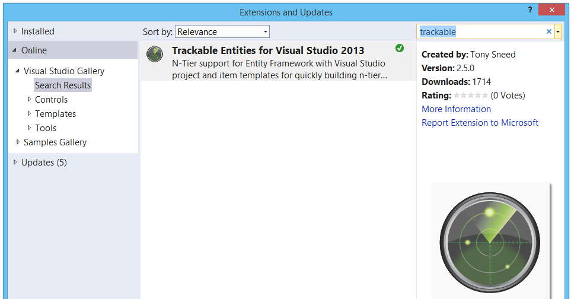

## Welcome to Trackable Entities!
Trackable Entities is a set of NuGet packages and Visual Studio extensions which facilitate *change-tracking across service boundaries* and provide multi-project Visual Studio templates for helping you *develop N-Tier applications* using **Entity Framework** and either **ASP.NET Web API** or **Windows Communication Foundation**.

Change-tracking is performed on .NET clients (desktop or mobile) in a *platform-agnostic manner*, with no dependency on Entity Framework or any other persistence API.  The client-side NuGet package is deployed as a **Portable Class Library** that can be used on all available platforms, including WPF, Silverlight, Windows Store, Windows Phone, Android and iOS (via Xamarin).

Entities are generated with *customizable* **T4 templates** with a database schema using the Entity Framework design tools or power tools.  A wizard will help you select either *client-side, server-side or shared entities*, depending on your preferences for separation of concerns.  Calling **GetChanges** on the change tracker will give you only the entities that have changed, saving on bandwidth for better performance.

On the server-side, Trackable Entities will traverse the object graph for one or more entities and their related entities, informing Entity Framework of the change state of each entity, so that when **SaveChanges** is called, inserts, updates and deletes will all be persisted *within a single transaction* -- and with a single round trip to the service.  Added entities are loaded from the database and returned to the client, where identity and other database-generated values are merged back into the original entities.

## Installation
The [Installation Guide](1-installation.html) will show you how to install the prerequisites for developing N-Tier applications using Trackable Entities.  You'll learn where you can get the **Visual Studio installer** (VSIX) for Trackable Entities (hint: it's right from within Visual Studio!), and how the **NuGet packages** work together to facilitate change-tracking across service boundaries.

## Gettings Started
The [Getting Started Guide](2-gettingstarted.html) will help you quickly get up to speed building N-Tier applications using the Visual Studio project and item templates installed with the Visual Studio extension for Trackable Entities.  Here you'll find guides for using the templates for ASP.NET Web API, Repository and Unit of Work patterns, and Windows Communication Foundation.  And don't forget to watch each of the **Getting Started Videos**.

## Samples
To further explore what Trackable Entities can do, simply download the project [Samples](3-samples.html).  There you'll find sample Visual Studio solutions for WCF, Web API, Repo/UoW Patterns, Model-First (EDMX), Inheritance, and Relations (1-1, M-M, etc).